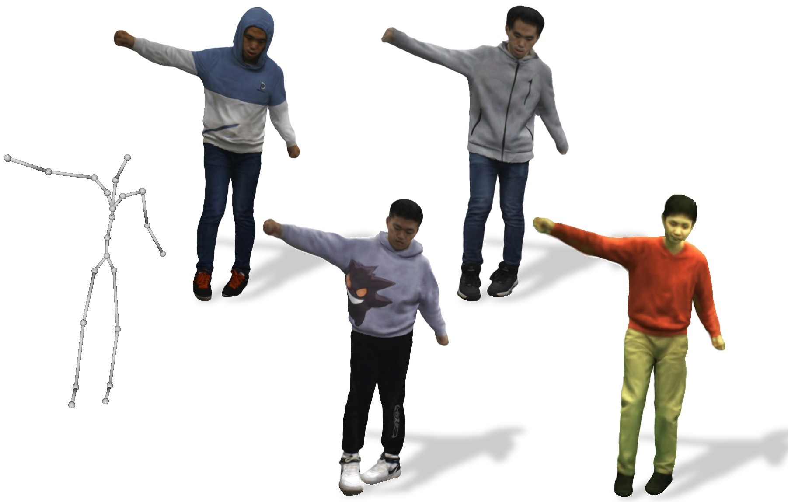

Hi, this is Zhe Li. 
I join Huawei as a researcher through [the TopMinds Program (华为“天才少年”计划)](https://career.huawei.com/reccampportal/portal5/topminds.html) in 2024.
Prior to that, I obtained my Ph.D. degree from Department of Automation, Tsinghua University, advised by Prof. [Yebin Liu](http://www.liuyebin.com/).
My research focuses on **human-centric 3D vision**, including 3D human reconstruction, animation and generation, etc.

<b>华为2012实验室-中央媒体院-CGXR工程部 实习生/全职招聘：</b> 
华为媒体院-CGXR工程部专注于三维视觉相关研究，如果您对我们的研究领域（包括但不限于三维重建、动画、三维/四维生成、可驱动对象生成）感兴趣，欢迎通过微信或邮件联系！ 
Base地：上海、杭州、北京、深圳等 
<b>WeChat:</b> nexus_unite 
<b>E-mail:</b> lizhe_thu[AT]126.com

## Background

<table style="width:100%;border:none;border-spacing:0px;border-collapse:separate;margin-right:auto;margin-left:auto;font-size: large">
<tr>
<td style="padding:20px;width:25%;vertical-align:middle;border:none" align="center">
 
</td>
<td style="padding:20px;width:75%;vertical-align:middle;border: none" align="left">
Ph.D. Sep. 2019 - Jun. 2024 
<a href="http://www.au.tsinghua.edu.cn/">Department of Automation</a> 
<a href="https://www.tsinghua.edu.cn/en/index.html">Tsinghua University</a> 
</td>
</tr>

<tr>
<td style="padding:20px;width:25%;vertical-align:middle;border:none" align="center">
 
</td>
<td style="padding:20px;width:75%;vertical-align:middle;border: none" align="left">
Bachelor of Engineering. Sep. 2015 - Jun. 2019 
<a href="https://sgy.ustc.edu.cn/">Class of the Gifted Young (少年班)</a> 
<a href="http://en.ustc.edu.cn/">University of Science and Technology of China</a> 
</td>
</tr>
</table>    

## Research

<table style="width:100%;border:none;border-spacing:0px;border-collapse:separate;margin-right:auto;margin-left:auto;font-size: large">
<tr>
<td style="padding:20px;width:30%;vertical-align:middle;border:none" align="center">
<video width="100%" playsinline="" autoplay="autoplay" loop="loop" preload="" muted="">
  <source src="images/ani_relit_gaussians.mp4" type="video/mp4">
</video>
</td>
<td style="padding:20px;width:70%;vertical-align:middle;border: none" align="left">
<b>Animatable and Relightable Gaussians for High-fidelity Human Avatar Modeling</b> 
<b>Zhe Li</b>*, Yipengjing Sun*, Zerong Zheng, Lizhen Wang, Shengping Zhang, Yebin Liu (*=equal contribution) 
<i>arXiv, 2024</i> 
<a href="https://animatable-gaussians.github.io/relight/"><i class="fas fa-fw fa-globe"></i>Projectpage</a> /
<a href="https://arxiv.org/pdf/2311.16096"><i class="fas fa-fw fa-file-pdf"></i>Paper</a> /
<a href="https://www.youtube.com/watch?v=odQOweNhsHM"><i class="fas fa-fw fa-video"></i>Video</a>
</td>
</tr>
</table>

---

<table style="width:100%;border:none;border-spacing:0px;border-collapse:separate;margin-right:auto;margin-left:auto;font-size: large">
<tr>
<td style="padding:20px;width:30%;vertical-align:middle;border:none" align="center">
<video width="100%" playsinline="" autoplay="autoplay" loop="loop" preload="" muted="">
  <source src="images/ani_relit_gaussians.mp4" type="video/mp4">
</video>
</td>
<td style="padding:20px;width:70%;vertical-align:middle;border: none" align="left">
<b>MeshAvatar: Learning High-quality Triangular Human Avatars from Multi-view Videos</b> 
Yushuo Chen, Zerong Zheng, <b>Zhe Li</b>, Chao Xu, Yebin Liu 
<i>European Conference on Computer Vision (<b>ECCV</b>), 2024</i> 
<a href="https://shad0wta9.github.io/meshavatar-page/"><i class="fas fa-fw fa-globe"></i>Projectpage</a> /
<a href="https://arxiv.org/pdf/2407.08414"><i class="fas fa-fw fa-file-pdf"></i>Paper</a> /
<a href="https://www.youtube.com/watch?v=Kpbpujkh2iI"><i class="fas fa-fw fa-video"></i>Video</a>
<a href="https://github.com/shad0wta9/meshavatar"><i class="fab fa-fw fa-github"></i>Code</a>
</td>
</tr>
</table>

---

<table style="width:100%;border:none;border-spacing:0px;border-collapse:separate;margin-right:auto;margin-left:auto;font-size: large">
<tr>
<td style="padding:20px;width:30%;vertical-align:middle;border:none" align="center">

</td>
<td style="padding:20px;width:70%;vertical-align:middle;border: none" align="left">
<b>LayGA: Layered Gaussian Avatars for Animatable Clothing Transfer</b> 
Siyou Lin, <b>Zhe Li</b>, Zhaoqi Su, Zerong Zheng, Hongwen Zhang, Yebin Liu 
<i>ACM <b>SIGGRAPH</b> Conference Proceedings, 2024</i> 
<a href="https://jsnln.github.io/layga/"><i class="fas fa-fw fa-globe"></i>Projectpage</a> /
<a href="https://arxiv.org/pdf/2405.07319"><i class="fas fa-fw fa-file-pdf"></i>Paper</a> /
<a href="https://jsnln.github.io/layga/assets/video_compressed.mp4"><i class="fas fa-fw fa-video"></i>Video</a>
</td>
</tr>
</table>

---

<table style="width:100%;border:none;border-spacing:0px;border-collapse:separate;margin-right:auto;margin-left:auto;font-size: large">
<tr>
<td style="padding:20px;width:30%;vertical-align:middle;border:none" align="center">

</td>
<td style="padding:20px;width:70%;vertical-align:middle;border: none" align="left">
<b>Animatable Gaussians: Learning Pose-dependent Gaussian Maps for High-fidelity Human Avatar Modeling</b> 
<b>Zhe Li</b>, Zerong Zheng, Lizhen Wang, Yebin Liu 
<i>IEEE Conference on Computer Vision and Pattern Recognition (<b>CVPR</b>), 2024</i> 
<a href="https://animatable-gaussians.github.io/"><i class="fas fa-fw fa-globe"></i>Projectpage</a> /
<a href="https://arxiv.org/pdf/2311.16096v3"><i class="fas fa-fw fa-file-pdf"></i>Paper</a> /
<a href="https://www.youtube.com/watch?v=kOmZxD0HxZI"><i class="fas fa-fw fa-video"></i>Video</a> /
<a href="https://github.com/lizhe00/AnimatableGaussians"><i class="fab fa-fw fa-github"></i>Code</a>
</td>
</tr>
</table>

---

<table style="width:100%;border:none;border-spacing:0px;border-collapse:separate;margin-right:auto;margin-left:auto;font-size: large">
<tr>
<td style="padding:20px;width:30%;vertical-align:middle;border:none" align="center">

</td>
<td style="padding:20px;width:70%;vertical-align:middle;border: none" align="left">
<b>Gaussian Head Avatar: Ultra High-fidelity Head Avatar via Dynamic Gaussians</b> 
Yuelang Xu, Benwang Chen, <b>Zhe Li</b>, Hongwen Zhang, Lizhen Wang, Zerong Zheng, Yebin Liu 
<i>IEEE Conference on Computer Vision and Pattern Recognition (<b>CVPR</b>), 2024</i> 
<a href="https://yuelangx.github.io/gaussianheadavatar/"><i class="fas fa-fw fa-globe"></i>Projectpage</a> /
<a href="https://arxiv.org/pdf/2312.03029.pdf"><i class="fas fa-fw fa-file-pdf"></i>Paper</a> /
<a href="https://www.youtube.com/watch?v=kvrrI3EoM5g"><i class="fas fa-fw fa-video"></i>Video</a> /
<a href="https://github.com/YuelangX/Gaussian-Head-Avatar"><i class="fab fa-fw fa-github"></i>Code</a>
</td>
</tr>
</table>

---

<table style="width:100%;border:none;border-spacing:0px;border-collapse:separate;margin-right:auto;margin-left:auto;font-size: large">
<tr>
<td style="padding:20px;width:30%;vertical-align:middle;border:none" align="center">

</td>
<td style="padding:20px;width:70%;vertical-align:middle;border: none" align="left">
<b>TexVocab: Texture Vocabulary-conditioned Human Avatars</b> 
Yuxiao Liu, <b>Zhe Li</b>, Yebin Liu, Haoqian Wang 
<i>IEEE Conference on Computer Vision and Pattern Recognition (<b>CVPR</b>), 2024</i> 
<a href="https://texvocab.github.io/"><i class="fas fa-fw fa-globe"></i>Projectpage</a> /
<a href="https://arxiv.org/pdf/2404.00524"><i class="fas fa-fw fa-file-pdf"></i>Paper</a>
</td>
</tr>
</table>

---

<table style="width:100%;border:none;border-spacing:0px;border-collapse:separate;margin-right:auto;margin-left:auto;font-size: large">
<tr>
<td style="padding:20px;width:30%;vertical-align:middle;border:none" align="center">

</td>
<td style="padding:20px;width:70%;vertical-align:middle;border: none" align="left">
<b>PoseVocab: Learning Joint-structured Pose Embeddings for Human Avatar Modeling</b> 
<b>Zhe Li</b>, Zerong Zheng, Yuxiao Liu, Boyao Zhou, Yebin Liu 
<i>ACM <b>SIGGRAPH</b> Conference Proceedings, 2023</i> 
<a href="https://lizhe00.github.io/projects/posevocab/"><i class="fas fa-fw fa-globe"></i>Projectpage</a> /
<a href="https://arxiv.org/pdf/2304.13006.pdf"><i class="fas fa-fw fa-file-pdf"></i>Paper</a> /
<a href="https://youtu.be/L-kg74A6yNc"><i class="fas fa-fw fa-video"></i>Video</a> /
<a href="https://github.com/lizhe00/PoseVocab"><i class="fab fa-fw fa-github"></i>Code</a>
</td>
</tr>
</table>

---

<table style="width:100%;border:none;border-spacing:0px;border-collapse:separate;margin-right:auto;margin-left:auto;font-size: large">
<tr>
<td style="padding:20px;width:30%;vertical-align:middle;border:none" align="center">

</td>
<td style="padding:20px;width:70%;vertical-align:middle;border: none" align="left">
<b>AvatarCap: Animatable Avatar Conditioned Monocular Human Volumetric Capture</b> 
<b>Zhe Li</b>, Zerong Zheng, Hongwen Zhang, Chaonan Ji, Yebin Liu 
<i>European Conference on Computer Vision (<b>ECCV</b>), 2022</i> 
<a href="http://www.liuyebin.com/avatarcap/avatarcap.html"><i class="fas fa-fw fa-globe"></i>Projectpage</a> /
<a href="https://arxiv.org/pdf/2207.02031.pdf"><i class="fas fa-fw fa-file-pdf"></i>Paper</a> /
<a href="http://www.liuyebin.com/avatarcap/assets/supp_video.mp4"><i class="fas fa-fw fa-video"></i>Video</a> /
<a href="https://github.com/lizhe00/AvatarCap"><i class="fab fa-fw fa-github"></i>Code</a>
</td>
</tr>
</table>

---

<table style="width:100%;border:none;border-spacing:0px;border-collapse:separate;margin-right:auto;margin-left:auto;font-size: large">
<tr>
<td style="padding:20px;width:30%;vertical-align:middle;border:none" align="center">

</td>
<td style="padding:20px;width:70%;vertical-align:middle;border: none" align="left">
<b>Robust and Accurate 3D Self-portraits in Seconds</b> 
<b>Zhe Li</b>, Tao Yu, Zerong Zheng, Yebin Liu 
<i>IEEE Transactions on Pattern Analysis and Machine Intelligence (<b>T-PAMI</b>), 2021</i> 
<a href="http://www.liuyebin.com/portrait/portrait.html"><i class="fas fa-fw fa-globe"></i>Projectpage</a> /
<a href="https://ieeexplore.ieee.org/document/9540284/"><i class="fas fa-fw fa-file-pdf"></i>Paper</a>
</td>
</tr>
</table>

---

<table style="width:100%;border:none;border-spacing:0px;border-collapse:separate;margin-right:auto;margin-left:auto;font-size: large">
<tr>
<td style="padding:20px;width:30%;vertical-align:middle;border:none" align="center">

</td>
<td style="padding:20px;width:70%;vertical-align:middle;border: none" align="left">
<b>POSEFusion: Pose-guided Selective Fusion for Single-view Human Volumetric Capture</b> 
<b>Zhe Li</b>, Tao Yu, Zerong Zheng, Kaiwen Guo, Yebin Liu 
<i>IEEE Conference on Computer Vision and Pattern Recognition (<b>CVPR</b>), 2021</i>  <b>(Oral presentation)</b> 
<a href="http://www.liuyebin.com/posefusion/posefusion.html"><i class="fas fa-fw fa-globe"></i>Projectpage</a> /
<a href="https://arxiv.org/pdf/2103.15331.pdf"><i class="fas fa-fw fa-file-pdf"></i>Paper</a> /
<a href="http://www.liuyebin.com/posefusion/assets/supp_video.mp4"><i class="fas fa-fw fa-video"></i>Video</a> /
<a href="https://youtu.be/34jrPLkiPrw"><i class="fas fa-fw fa-video"></i>Talk</a> 
</td>
</tr>
</table>

---

<table style="width:100%;border:none;border-spacing:0px;border-collapse:separate;margin-right:auto;margin-left:auto;font-size: large">
<tr>
<td style="padding:20px;width:30%;vertical-align:middle;border:none" align="center">

</td>
<td style="padding:20px;width:70%;vertical-align:middle;border: none" align="left">
<b>Lightweight Multi-person Total Motion Capture Using Sparse Multi-view Cameras</b> 
Yuxiang Zhang, <b>Zhe Li</b>, Liang An, Mengcheng Li, Tao Yu, Yebin Liu 
<i>IEEE International Conference on Computer Vision (<b>ICCV</b>), 2021</i> 
<a href="http://www.liuyebin.com/lwtotalcap/lwtotalcap.html"><i class="fas fa-fw fa-globe"></i>Projectpage</a> /
<a href="https://arxiv.org/pdf/2108.10378.pdf"><i class="fas fa-fw fa-file-pdf"></i>Paper</a> /
<a href="http://www.liuyebin.com/lwtotalcap/assets/video.mp4"><i class="fas fa-fw fa-video"></i>Video</a>
</td>
</tr>
</table>

---

<table style="width:100%;border:none;border-spacing:0px;border-collapse:separate;margin-right:auto;margin-left:auto;font-size: large">
<tr>
<td style="padding:20px;width:30%;vertical-align:middle;border:none" align="center">

</td>
<td style="padding:20px;width:70%;vertical-align:middle;border: none" align="left">
<b>Robust 3D Self-portraits in Seconds</b> 
<b>Zhe Li</b>, Tao Yu, Chuanyu Pan, Zerong Zheng, Yebin Liu 
<i>IEEE Conference on Computer Vision and Pattern Recognition (<b>CVPR</b>), 2020</i>  <b>(Oral presentation)</b> 
<a href="http://www.liuyebin.com/portrait/portrait.html"><i class="fas fa-fw fa-globe"></i>Projectpage</a> /
<a href="http://openaccess.thecvf.com/content_CVPR_2020/papers/Li_Robust_3D_Self-Portraits_in_Seconds_CVPR_2020_paper.pdf"><i class="fas fa-fw fa-file-pdf"></i>Paper</a> /
<a href="http://www.liuyebin.com/portrait/assets/portrait.mp4"><i class="fas fa-fw fa-video"></i>Video</a> /
<a href="https://youtu.be/nx-pzk12hLY"><i class="fas fa-fw fa-video"></i>Talk</a> 
</td>
</tr>
</table>

## Awards
+ <b>Huawei TopMinds Program (华为“天才少年”称号)</b>, 2023
+ Tsinghua Kuaishou Scholarship, Tsinghua University, 2023
+ Tsinghua Alumni Li Yanda Scholarship, Tsinghua University, 2022
+ <b>National Scholarship</b>, Ministry of Education of China, 2021

## Contact
<b>E-mail:</b> lizhe_thu[AT]126.com
