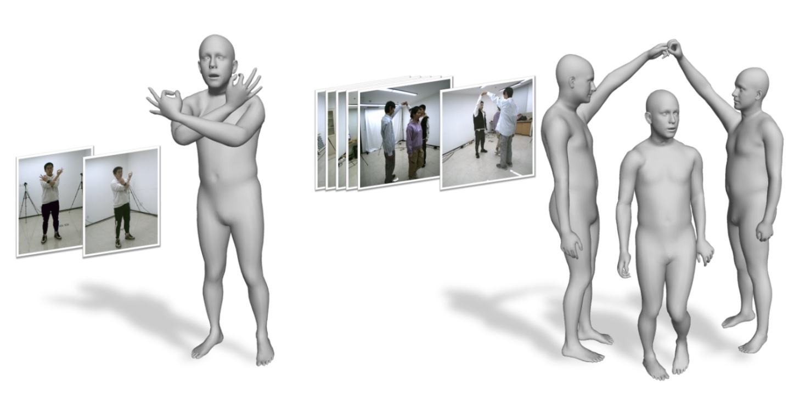

Hi, this is Zhe Li. I am a 4th year Ph.D. student in Department of Automation, Tsinghua University, supervised by Prof. [Yebin Liu](http://www.liuyebin.com/). My research focuses on 3D computer vison, specifically animatable avatars, human reconstruction and volumetric capture.

I expect to graduate in June 2024.

## Background

Ph.D. Student. Sep. 2019 - Present, [Department of Automation](http://www.au.tsinghua.edu.cn/), [Tsinghua University](https://www.tsinghua.edu.cn/en/index.htm). 
Bachelor of Engineering. Sep. 2015 - Jun.2019, [School of the Gifted Young](http://en.scgy.ustc.edu.cn/), [University of Science and Technology of China](http://en.ustc.edu.cn/).

## Publication

\* indicates equal contribution.

---

<b>AvatarCap: Animatable Avatar Conditioned Monocular Human Volumetric Capture</b> 
<b>Zhe Li</b>, Zerong Zheng, Hongwen Zhang, Chaonan Ji, Yebin Liu 
<i>European Conference on Computer Vision (<b>ECCV</b>), 2022</i> 
[[Projectpage]](http://www.liuyebin.com/avatarcap/avatarcap.html) [[Paper]](https://arxiv.org/pdf/2207.02031.pdf) [[Code]](https://github.com/lizhe00/AvatarCap) 

---

<b>Robust and Accurate 3D Self-portraits in Seconds</b> 
<b>Zhe Li</b>\*, Tao Yu\*, Zerong Zheng, Yebin Liu 
<i>IEEE Transactions on Pattern Analysis and Machine Intelligence (<b>T-PAMI</b>), 2021</i> 
[[Paper]](https://ieeexplore.ieee.org/document/9540284/) [[Dataset (Please email me)]](mailto:liz19@mails.tsinghua.edu.cn) 

---

<b>Lightweight Multi-person Total Motion Capture Using Sparse Multi-view Cameras</b> 
Yuxiang Zhang, <b>Zhe Li</b>, Liang An, Mengcheng Li, Tao Yu\*, Yebin Liu\* 
<i>IEEE International Conference on Computer Vision (<b>ICCV</b>), 2021</i> 
[[Projectpage]](http://www.liuyebin.com/lwtotalcap/lwtotalcap.html)  [[Paper]](https://arxiv.org/pdf/2108.10378.pdf)  [[Supp Video]](http://www.liuyebin.com/lwtotalcap/assets/video.mp4) 

---

<b>POSEFusion: Pose-guided Selective Fusion for Single-view Human Volumetric Capture</b> 
<b>Zhe Li</b>, Tao Yu, Zerong Zheng, Kaiwen Guo, Yebin Liu 
<i>IEEE Conference on Computer Vision and Pattern Recognition (<b>CVPR</b>), 2021</i>  (Oral presentation) 
[[Projectpage]](http://www.liuyebin.com/posefusion/posefusion.html)  [[Paper]](https://arxiv.org/pdf/2103.15331.pdf)  [[Oral Talk]](https://youtu.be/34jrPLkiPrw)  [[Supp Video]](http://www.liuyebin.com/posefusion/assets/supp_video.mp4) 

---

<b>Robust 3D Self-portraits in Seconds</b> 
<b>Zhe Li</b>, Tao Yu, Chuanyu Pan, Zerong Zheng, Yebin Liu 
<i>IEEE Conference on Computer Vision and Pattern Recognition (<b>CVPR</b>), 2020</i>  (Oral presentation) 
[[Projectpage]](http://www.liuyebin.com/portrait/portrait.html)  [[Paper]](http://openaccess.thecvf.com/content_CVPR_2020/papers/Li_Robust_3D_Self-Portraits_in_Seconds_CVPR_2020_paper.pdf)  [[Oral Talk]](https://youtu.be/nx-pzk12hLY)  [[Supp Video]](http://www.liuyebin.com/portrait/assets/portrait.mp4) 

## Award
+ Tsinghua Alumni Li Yanda Scholarship, Tsinghua University, 2022
+ <b>National Scholarship</b>, Ministry of Education of China, 2021